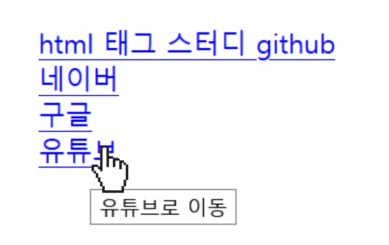
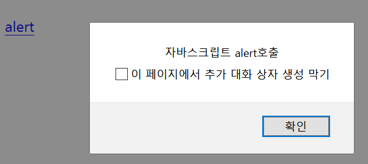
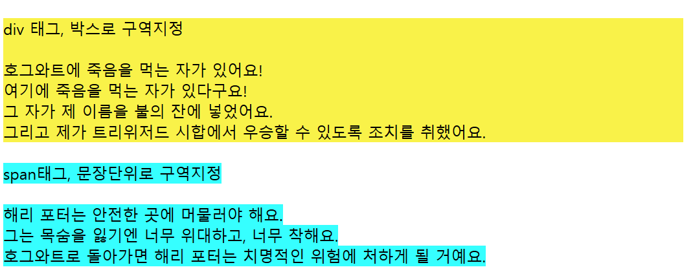
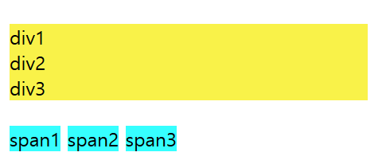
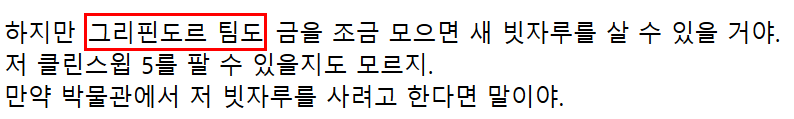
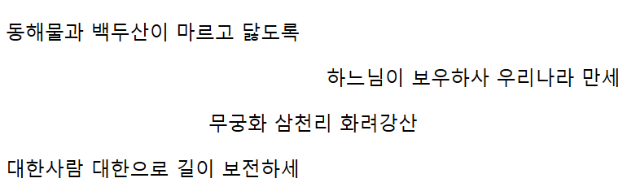
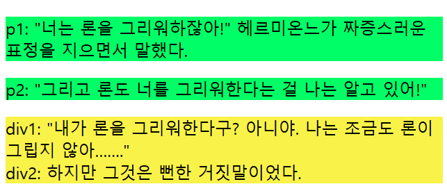

# week2
## a, span, p

### 1. a 태그

a 속성은 세가지가 있다.
- href: 연결할 주소 지정
- target: 링크를 클릭할 때 창을 어떻게 열지 설정
  1) \_self : 해당 창에서 연다
  2) \_blank: 새창으로 연다
  3) \_parent: 부모창에서 연다 (없으면 \_self)
  4) \_top: 가장 상위 창에서 연다 (없으면 \_self)
- title: 링크에 커서를 올릴때 뜨는 문구

```html
<a href="https://github.com/Euna789/HTML-TAG-STUDY/tree/master/euna">html 태그 스터디 github</a>

<a href="https://www.naver.com" target="_blank">네이버</a> //새창에서 열기
<a href="https://www.google.com" target="_self">구글</a> //현재창에서 열기

<a href="https://www.youtube.com" title="유튜브로 이동">유튜브</a>
```


```html
<a href="javascript:alert('자바스크립트 alert호출')">alert</a>
```


### 2. span 태그

span 속성
- display
- width, height
- background-color, color
- font-style
- margin, padding
- border

span과 div의 차이
- div와 span은 영역을 설정할 때 사용한다. 
- div는 줄바꿈이 되지만 span은 옆으로 붙음
- div는 사각형 박스로 구역지정, span은 문장 단위로 지정

```html
<div style="background-color: #f9f249;width:700px">
    div 태그, 박스로 구역지정<br /><br />
    호그와트에 죽음을 먹는 자가 있어요!<br /> 
    여기에 죽음을 먹는 자가 있다구요! <br />
    그 자가 제 이름을 불의 잔에 넣었어요. <br />
    그리고 제가 트리위저드 시합에서 우승할 수 있도록 조치를 취했어요.
</div>
<br />
<span style="background-color: #36ffff;">
    span태그, 문장단위로 구역지정 <br /><br />
    해리 포터는 안전한 곳에 머물러야 해요. <br />
    그는 목숨을 잃기엔 너무 위대하고, 너무 착해요. <br />
    호그와트로 돌아가면 해리 포터는 치명적인 위험에 처하게 될 거예요.
</span>
```


```html
<div style="background-color: #f9f249;width:300px">div1</div>
<div style="background-color: #f9f249;width:300px">div2</div>
<div style="background-color: #f9f249;width:300px">div3</div>
<br />
<span style="background-color: #36ffff;">span1</span>
<span style="background-color: #36ffff;">span2</span>
<span style="background-color: #36ffff;">span3</span>
```



span은 줄바꿈이 없어 문장 사이에서 강조할 때 사용하기 좋다.
```html
<div> 하지만 <span style="border:2px solid red">그리핀도르 팀도</span> 금을 조금 모으면 새 빗자루를 살 수 있을 거야.<br />
    저 클린스윕 5를 팔 수 있을지도 모르지.<br />
    만약 박물관에서 저 빗자루를 사려고 한다면 말이야.<br />
</div>
```


### 3. p 태그

p태그는 하나의 문단을 만들 때 쓰인다.
p태그에서 가장 많이 사용하는 속성은 align, 정렬임

```html
 <p>동해물과 백두산이 마르고 닳도록</p>
 <p align = "right">하느님이 보우하사 우리나라 만세</p> 
 <p align = "center">무궁화 삼천리 화려강산</p> 
 <p align = "justify">대한사람 대한으로 길이 보전하세</p>
```
  
  
\</p>다음은 무조건 한 줄이 비어있음
```html
<p style="background-color: #00ff66">
    p1: "너는 론을 그리워하잖아!" 헤르미온느가 짜증스러운 표정을 지으면서 말했다.
</p>
<p style="background-color: #00ff66">
    p2: "그리고 론도 너를 그리워한다는 걸 나는 알고 있어!"
</p>

<div style="background-color: #f9f249;">
    div1: "내가 론을 그리워한다구? 아니야. 나는 조금도 론이 그립지 않아……."
</div>
<div style="background-color: #f9f249;">
    div2: 하지만 그것은 뻔한 거짓말이었다.
</div>
```
  

* * *
참조
- https://electronic-moongchi.tistory.com/87
- https://mainia.tistory.com/3289
- https://coding-factory.tistory.com/189
- https://miaow-miaow.tistory.com/94
