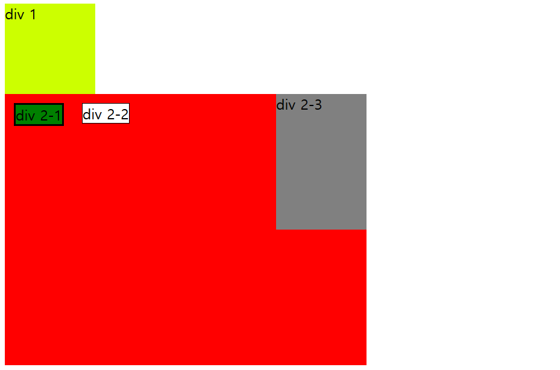
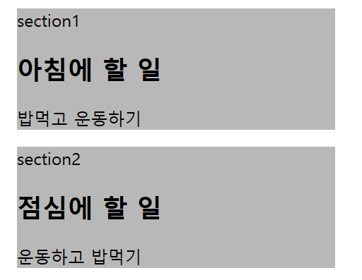

# week1
## div, section

### 1. div

div 속성
1. style은 \<div>태그의 스타일을 지정해주는 것으로 다른 속성들을 사용할 수 있게끔 해줍니다. \<div style="">
2. width는 \<div>의 가로 크기를 정해줍니다. px(픽셀)단위로도 정할 수 있고 %(비율)단위로도 정할 수 있습니다.
3. height는 \<div>의 세로 크기를 정해줍니다. px(픽셀)단위로도 정할 수 있고 %(비율)단위로도 정할 수 있습니다.
4. border은 \<div>의 테두리의 굵기를 정해줍니다. 숫자가 클수록 굵기가 굵어집니다.
5. background-color은 \<div>태그의 배경색상을 정하는 속성입니다.
6. float은 div의 정렬(좌,우)을 하는 속성입니다. 가운데정렬은 안됩니다.
7. margin은 div의 정렬기준 끝에서부터 여백을 주는 속성입니다. (margin-top,margin,-bottom,margin-left,margin-right)

출처 (https://coding-factory.tistory.com/188)

```html
<div style="width:100px; height:100px; background-color:#CF0">div 1</div>
<div style="background-color:red; width:400; height:300">
    <div style="float:left; border:2px solid black; background-color:green; margin:10px">div 2-1</div>
    <div style="float:left; border:1px solid black; background-color: white; margin:10px">div 2-2</div>
    <div style="float:inline-end;width:100; height:150; background-color:gray";>div 2-3</div>
</div>
```


### 2. section

div는 의미없이 단순히 내용을 묶어주는 역할을 한다면 section은 연결성이 있는 내용을 묶어준다.

```html
<section style="width:300; background-color:rgb(184, 184, 184); margin:10px"> section1
    <h1>아침에 할 일</h1>
    <p>밥먹고 운동하기</p>
</section>

<section style="width:300; background-color:rgb(184, 184, 184); margin:10px">section2
    <h1>점심에 할 일</h1>
    <p>운동하고 밥먹기</p>
</section>
```

