# week 5
## form, input, label

### 1. form  
form은 입력 양식 전체를 감싸는 태그, text, button, radio등을 컨트롤한다.

form 속성  
|속성|설명||
|---|---|---|
|**name**|form의 이름|서버로 보내질 때 이름의 값으로 데이터 전송|  
|**action**|form이 전송되는 서버 url 또는 html링크||  
|**method**|전송방법 설정|get은 default, post는 데이터를 url에 공개하지 않고 숨겨서 전송|  
|**autocomplete**|자동완성|on으로 하면 form 전체에 자동완성 허용|  

```html
<form name="profile" action="/action_page.php" method="get" 
      autocomplete="on">
  <input type="text" name="id">
  <select>
    <option value="blue">
  </select>
</form>
```
  
 
   
### 2. form 내부 태그  
-> input, textarea, select, label 태그가 있음.
  
① input  
|속성|설명|예시
|---|---|---|  
|**type**|입력형식|text, password, button, submit, reset, radio, checkbox, file, hidden|  
|**name**|서버로 전송되는 데이터 이름|

- text type
value: 기본값, 값을 입력하기 전 text칸에 쓰여있음.  
placeholder: 칸 안에 default로 쓰여있는 값.   
required pattern: 입력 형식을 지정할 수 있다.  
autocomplete:자동완성  
autofocus: html작동시 초기 커서의 위치로 설정  
  
  
```html
TEXT: <input type="text" name="id" value="value" placeholder="placeholder"
       required pattern="[a-zA-Z].+[0-9]" autocomplete="off" autofocus>
```
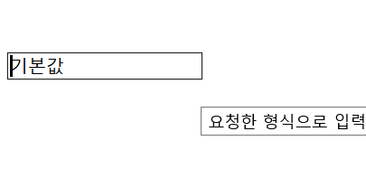
  
- password type  
비밀번호 입력 시 사용, 입력 내용이 보이지 않는다.
```html
Password: 
<input type="password" name="pwd" placeholder="password를 입력하세요.">
```
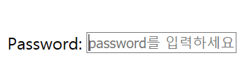 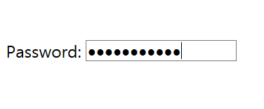

- button type  
```html
Button: 
<input type="button" value="전송" onclick="alert('알림을 띄웁니다')">
```
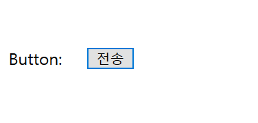 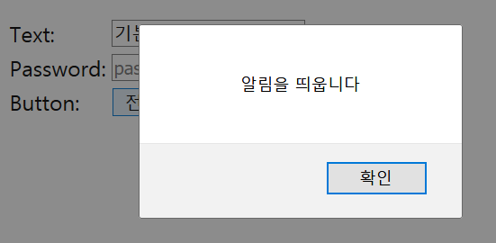
  
- reset type  
form에 입력한 모든 데이터를 초기화한다.
```html
Reset:
<input type="reset">
```
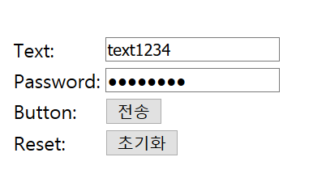 --> reset 후 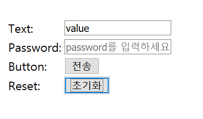
  
- radio type  
여러 항목 중 단일선택  
checked로 미리 선택해놓을 수 있다.  
같은 name의 radio버튼중에서 선택됨  
  
```html
Radio:
<input type="radio" name="time" value="eightToNine"> 8-9시 <br>
<input type="radio" name="time" value="eightToNine" checked> 11-12시
```
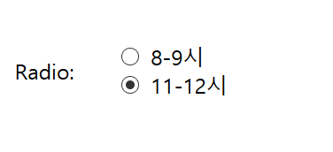

- checkbox type  
여러 항목 중 다중선택 가능  
마찬가지로 checked로 미리 선택해 놓을 수 있음  
같은 name으로 분류  
```html
<input type="checkbox" name="game_title" value="zelda" checked> 젤다의전설 야생의숨결<br>
<input type="checkbox" name="game_title" value="ringFit" checked> 링피트 <br>
<input type="checkbox" name="game_title" value="animalCrossing" checked> 모여봐요 동물의숲<br>
```
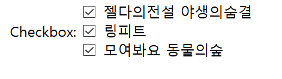

  
- file type  
파일 업로드를 컨트롤함  
method="post"일 때만 가능  
enctype: form데이터를 서버로 제출할 때 데이터가 인코딩 된 방법을 명시  
"multipart/form-data": 모든 문자를 인코딩하지 않음  

```html
<form action="formInputLabel.html" method="post" enctype="multipart/form-data">
      <input type="file" name="selected-file">
      <input type="submit">
</form>
```
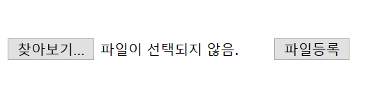  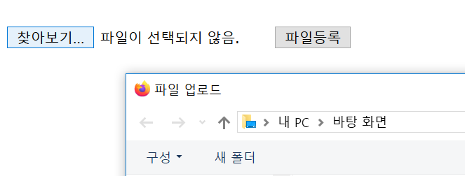 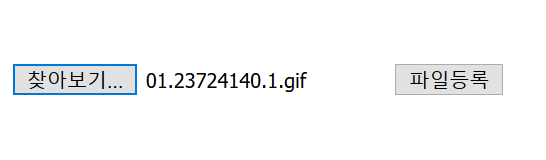

- hidden type  
눈에 보이지 않는 정보를 서버쪽으로 보낼 때 사용  

```html
<input type="hidden" name="hide" value="숨겨진 내용">
```
  
* * *
② textarea  
여러 줄의 텍스트 입력  
cols, rows로 입력 글자 수 설정 가능  

```html
<form>
      <p> textarea:
            <textarea cols="50" rows="3" placeholder="default"> 입력하세요.</textarea>
      </p>
</form>
```
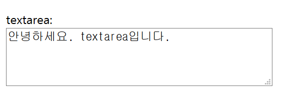
  
  
* * *
③ select  
드롭다운 형식의 선택, 선택 항목은 option으로  
value: 서버에 전송되는 값  
```html
<form>
      <select name="College">
            <option value="Engineering"> 공과대학 </option>
            <option value="LiberalArts"> 인문과학대학 </option>
            <option value="SocialSciences"> 사회과학대학 </option>
            <option value="ArtAndDesign"> 조형예술대학 </option>
      </select>
      <select name="major">
            <option value="CSE"> 컴퓨터공학과 </option>
            <option value="FSE"> 식품공학과 </option>
            <option value="Architecture"> 건축학과 </option>
            <option value="Envse"> 환경공학과 </option>
      </select>
</form>     
```
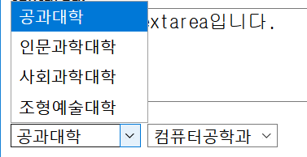

* * *
④ label   
form의 양식에 이름을 붙이는 태그  
주요 속성은 for (label의 for와 양식의 id값이 같으면 연결된다.)  
label을 클릭하면 연결된 양식에 입력할 수 있도록 하거나, 체크를 하거나/해제한다.  
```html
<form>
      <p>
            <label for="input_text"> Input-Text </label>
            <input type="text" id="input_text">
      </p>
      <p>
            <label for="input_checkbox"> Input-Checkbox </label>
            <input type="checkbox" id="input_checkbox">
      </p>
</form>
```
*또는*  
```html
<label> Input-Text <input type="text"> </label>
```
와 같이 label로 감싸는 형태이면 id나 for 없이도 같은 결과를 얻을 수 있다   
  
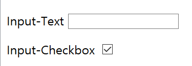  
--> label 글자를 클릭해도 textarea, checkbox를 클릭한 것과 같은 반응을 보임  

* * *
참조
- https://velog.io/@choiiis/HTMLCSS-form-%ED%83%9C%EA%B7%B8-%EC%A0%95%EB%A6%AC
- https://www.codingfactory.net/11008
