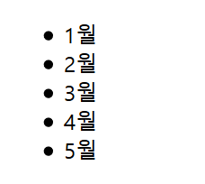
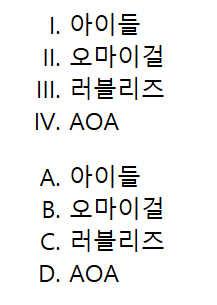
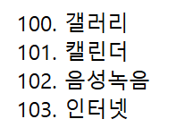
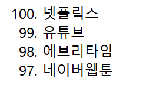
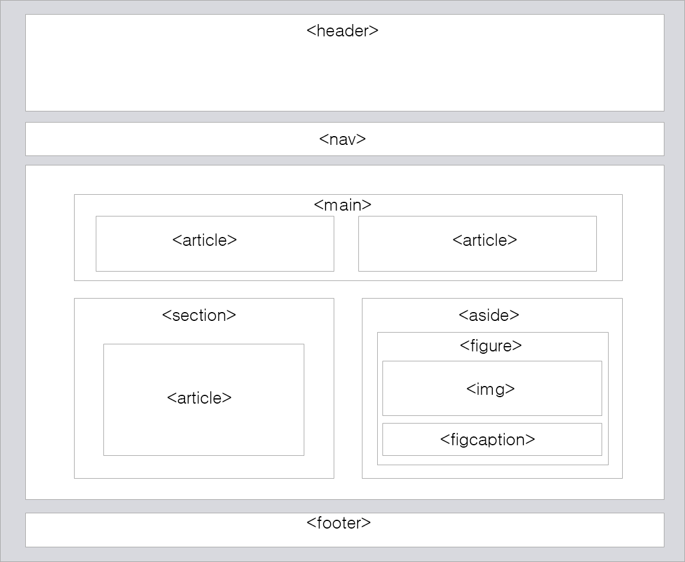

# week 6
## li, h, layout

### 1. li

ul과 ol 하위에 li 태그가 올 수 있음.
- ol: 순서있는 항목
- ul: 순서없는 항목
```html
<ul>
  <li> 1월 </li>
  <li> 2월 </li>
  <li> 3월 </li>
  <li> 4월 </li>
  <li> 5월 </li>
</ul>
```


\<속성>  
--ol태그에서만 지원됨--
- type : 1/a/A/i/I
```html
<ol type="I">
  <li> 아이들 </li>
  <li> 오마이걸 </li>
  <li> 러블리즈</li>
  <li> AOA </li>
</ol>

<ol type="A">
  <li> 아이들 </li>
  <li> 오마이걸 </li>
  <li> 러블리즈</li>
  <li> AOA </li>
</ol>
```


- start : 시작값
```html
<ol start="100">
  <li> 갤러리 </li>
  <li> 캘린더 </li>
  <li> 음성녹음 </li>
  <li> 인터넷 </li>
</ol>
```


- reversed : 항목 순서를 거꾸로
```html
<ol start="100" reversed>
  <li> 넷플릭스 </li>
  <li> 유튜브 </li>
  <li> 에브리타임 </li>
  <li> 네이버웹툰 </li>
</ol>
```

  
  
### 2. h1 ~ h6
```html
<h1> h1 월요일</h1>
<h2> h2 화요일</h2>
<h3> h3 수요일</h3>
<h4> h4 목요일</h4>
<h5> h5 금요일</h5>
<h6> h6 토요일</h6>
일요일
```

### layout

|의미요소|설명|
|---|---|
|header|문서, 섹션에 대한 헤더를 정의|
|nav|문서의 탐색 링크|
|section|섹션부분|
|article|독립적인 하나의 글|
|aside|페이지 부분 이외의 컨텐츠|
|footer|문서, 섹션에 대한 푸터를 정의|

```html
<html>
    <head>
        <title>layout</title>
        <style>
            body {
                text-align: center;
                color: black;
                width: 1000px;
            }
            div#wapper{
                width:100%;
                text-align:left;
                min-height:300px;
                margin:0 auto;
            }
            header, footer, nav, aside, section{
                border: 1px solid #999;
                margin: 5px;
                padding: 10px;
            }
            header{
                height: 50px;
                background-color: #6ba292;
            }
            nav, section, aside{
                float: left;
                height: 200px;
            }
            nav{
                background-color: #ffdc7c;
                width: 130px;
            }
            section{
                background-color: #e4fde1;
                width:604px;
            }
            aside{
                background-color: #ff9b71;
                width: 170px;
            }
            footer{
                height: 50px;
                background-color: #dd614a;
                position: relative;
                clear: both;
            }
            article{
                width:90%;
                margin:20px;
                background-color:white;
                border: 1px solid gray;
            }
        </style>
    </head>
    <body>
        <div id="wapper">
            <header><h2>Header 영역</h2></header>

            <nav>
                <h2>Nav 영역</h2>
                <ul>
                    <li> 탐색1 </li>
                    <li> 탐색2 </li>
                    <li> 탐색3 </li> 
                </ul>
            </nav>
            
            <section>
                Section 영역
                <article>article 1</article>
                <article>article 2</article>
            </section>
    
            <aside>
                aside 영역
                <figure>
                    figure 영역
                    
                    <figcaption> 아트박스 말리인형</figcaption>
                </figure>
            </aside>
            
            <footer><h2>Footer 영역</h2></footer>
        </div>
    </body>
</html>
```


* * *
참조
- https://aboooks.tistory.com/210
- https://aboooks.tistory.com/70
- http://tcpschool.com/html/html_space_layouts
