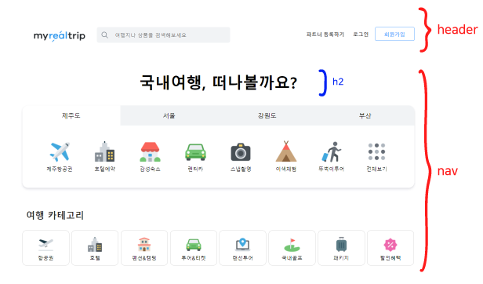
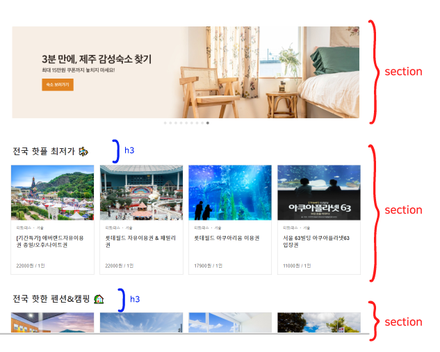
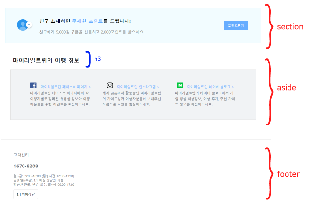

# week 7
## myrealtrip 클론코딩
link: https://euna789.github.io/HTML-TAG-STUDY/euna/myRealTrip.html

### 전체 구조





### header
로고, 검색, 로그인, 회원가입

- header안의 요소들을 가로로 배치하고 싶을 때는 div 클래스를 같은 것으로 묶고, float:left;로 설정한다.

```html
<header>
  <div class="mainHeader">
    
  </div>
  <div  id="searchContainer" class="mainHeader">
    <form>
      ...
    </form>
  </div>  
  ...
</header>
```

```css
.mainHeader{
  float:left;
}
```

- 로그인, 회원가입의 경우 오른쪽부터 배치해야한다. float:right;로 설정한다.
```html
<header>
  ...
  <input class="headerBtn" id="signIn" type="button" value="회원가입" onclick="alert('회원가입')">
  <input class="headerBtn" type="button" value="로그인" onclick="alert('로그인')">
  <input class="headerBtn" type="button" value="파트너 등록하기" onclick="alert('파트너 등록하기')">
</header>
```

```css
.headerBtn{
  float:right;
}
```
 * 특정 요소의 float를 해제하고 싶을 경우 clear:both를 사용해야한다.  
참조:https://rgy0409.tistory.com/2935


### nav
- h2로 국내여행 떠나볼까요  
  
- li를 이용해 도시 이름 배치, ```display: inline-block;```을 이용하면 가운데정렬 가능  
  
- ```border-radius:15px;```를 이용해 모서리를 둥글게 표현 가능하다.  
참조:https://www.codingfactory.net/10957

- button의 hover효과 주는법
```css
button:hover{
  background-color:#f1f3f5;
}
```
  
  
### aside
- a 태그의 속성을 없애고 싶은 경우 ``` a { text-decoration: none; }```을 이용한다.  
참조 : https://electronic-moongchi.tistory.com/90


### 전체 가운데정렬
- body의 width를 100%로 해주어야 전체적인 컨텐츠가 가운데로 온다.
```css
body{
text-align:center;
width:100%;
}
```
