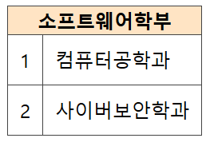

# week3
## table (tr, td, th)

\<table>은 header cell과 standard cell로 나누어짐  
\<th>를 header cell, 나머지를 standard cell이라고 부름  

- \<th> : table header, 표의 제목
- \<tr> : table row, 가로줄
- \<td> : table data, 셀을 만든다.  

```html
<table>
  <tr>
    <th> week </th>
    <th> tag </th>
  </tr>
  <tr>
    <td> 1 </td>
    <td> div, section </td>
  </tr>
  <tr>
    <td> 2 </td>
    <td> a, span, p </td>
  </tr>
  <tr>
    <td> 3 </td>
    <td> table, tr, td, th </td>
  </tr>
</table>
```


### table border 속성  
- border : 테두리, ```css border: 1px solid #444444;```와 같이 사용
- border-collapse : 테두리 사이 간격 ``` border-collapse: collapse;``` 일 때 테두리 한줄로 나타남.

### table 속성
- colsapn
- rowspan
- border
- bgcolor
- height
- valign  

① colspan
```html
<table>
  <tr>
    <th colspan="2"> 소프트웨어학부 </th>
  </tr>
  <tr>
    <td> 1 </td>
    <td> 컴퓨터공학과 </td>
  </tr>
  <tr>
    <td> 2 </td>
    <td> 사이버보안학과 </td>
  </tr>
</table>
```



* * *
참조
- https://aboooks.tistory.com/59
